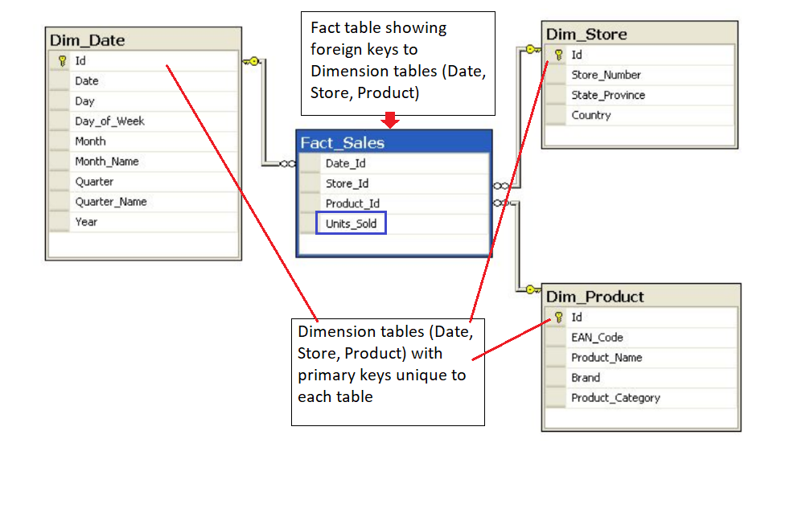

## [Learning Objective](https://www.youtube.com/watch?v=S1G7BurtYJ0)

## [Databases](https://www.youtube.com/watch?v=EvjmD7mTqQM)

**Rule 1: The information rule:**

All information in a relational database is represented explicitly at the logical level and in exactly one way – by values in tables.

More information on Codd's 12 Rules can be found here: [Wikipedia link](https://en.wikipedia.org/wiki/Codd%27s_12_rules)


## [Importance of Relational Database](https://www.youtube.com/watch?v=QgBHz0bL1Sw)

- **Standardization of data model**: Once your data is transformed into the rows and columns format, your data is standardized and you can query it with SQL

- **Flexibility in adding and altering tables**: Relational databases gives you flexibility to add tables, alter tables, add and remove data.

- **Data Integrity**: Data Integrity is the backbone of using a relational database.

- **Structured Query Language (SQL)**: A standard language can be used to access the data with a predefined language.

- **Simplicity **: Data is systematically stored and modeled in tabular format.

- **Intuitive Organization**: The spreadsheet format is intuitive but intuitive to data modeling in relational databases.

## [OLAP vs OLTP](https://www.youtube.com/watch?v=ocoyWgYllFE)

- **Online Analytical Processing (OLAP):**

Databases optimized for these workloads allow for complex analytical and ad hoc queries, including aggregations. These type of databases are optimized for reads.

- **Online Transactional Processing (OLTP):**

Databases optimized for these workloads allow for less complex queries in large volume. The types of queries for these databases are read, insert, update, and delete.

The key to remember the difference between OLAP and OLTP is analytics (A) vs transactions (T). If you want to get the price of a shoe then you are using OLTP (this has very little or no aggregations). If you want to know the total stock of shoes a particular store sold, then this requires using OLAP (since this will require aggregations).

- **Additional Resource on the difference between OLTP and OLAP:**

This [Stackoverflow post](https://stackoverflow.com/questions/21900185/what-are-oltp-and-olap-what-is-the-difference-between-them) describes it well.

Note: We will also be going more in depth with OLAP vs OLTP in Course **3. Cloud Data Warehouses**

## [Structuring the Database: Normalization](https://www.youtube.com/watch?v=92dREpe9SLg)

## [Objectives of Normal Form](https://www.youtube.com/watch?v=B_JtLJbhszM)

- To free the database from unwanted insertions, updates, & deletion dependencies

- To reduce the need for refactoring the database as new types of data are introduced

- To make the relational model more informative to users

- To make the database neutral to the query statistics

See this [Wikipedia page] to learn more.

## [Normal Forms](https://www.youtube.com/watch?v=ZUnI99efjJQ)

1. How to reach First Normal Form (1NF):

    + Atomic values: each cell contains unique and single values

    + Be able to add data without altering tables

    + Separate different relations into different tables

    + Keep relationships between tables together with foreign keys

2. Second Normal Form (2NF):

    + Have reached 1NF

    + All columns in the table must rely on the Primary Key

3. Third Normal Form (3NF):

    + Must be in 2nd Normal Form

    + No transitive dependencies

    + Remember, transitive dependencies you are trying to maintain is that to get from A-> C, you want to avoid going through B.

**When to use 3NF:**

- When you want to update data, we want to be able to do in just 1 place. We want to avoid updating the table in the Customers Detail table (in the example in the lecture slide).

## [Demo 1: Creating Normalize Tables](https://www.youtube.com/watch?v=zdonkmTttaI)

Again, the goal of the demo was to maintain data integrity and reducing data redundancy.

Here is the link to the [demo file](https://video.udacity-data.com/topher/2019/March/5c9eaee6_lesson-2-demo-1-creating-normalized-tables/lesson-2-demo-1-creating-normalized-tables.ipynb).

## [Denormalization](https://www.youtube.com/watch?v=jJezt6YGweA)

JOINS on the database allow for outstanding flexibility but are extremely slow. If you are dealing with heavy reads on your database, you may want to think about denormalizing your tables. You get your data into normalized form, and then you proceed with denormalization. So, denormalization comes after normalization.

Citation for slides: [https://en.wikipedia.org/wiki/Denormalization](https://en.wikipedia.org/wiki/Denormalization)

## [Demo 2: Creating Denormalized Tables](https://www.youtube.com/watch?v=Wm11Mq8ez-A)

Here is the link to the [demo notebook](https://video.udacity-data.com/topher/2019/March/5c9eb1d2_lesson-2-demo-2-creating-denormalized-tables/lesson-2-demo-2-creating-denormalized-tables.ipynb).

## Denormalization Vs. Normalization

**Normalization** is about trying to increase data integrity by reducing the number of copies of the data. Data that needs to be added or updated will be done in as few places as possible.

**Denormalization** is trying to increase performance by reducing the number of joins between tables (as joins can be slow). Data integrity will take a bit of a potential hit, as there will be more copies of the data (to reduce JOINS).

## [Fact and Dimension Tables](https://www.youtube.com/watch?v=3ala0SDBCyY)

The following image shows the relationship between the fact and dimension tables for the example shown in the video. As you can see in the image, the unique primary key for each Dimension table is included in the Fact table.

In this example, it helps to think about the **Dimension tables** providing the following information:

- Where the product was bought? (Dim_Store table)

- When the product was bought? (Dim_Date table)

- What product was bought? (Dim_Product table)

The **Fact table** provides the **metric of the business process** (here Sales).

- **How many** units of products were bought? (Fact_Sales table)



If you are familiar with **Entity Relationship Diagrams** (ERD), you will find the depiction of STAR and SNOWFLAKE schemas in the demo familiar. The ERDs show the data model in a concise way that is also easy to interpret. ERDs can be used for any data model, and are not confined to STAR or SNOWFLAKE schemas. Commonly available tools can be used to generate ERDs. However, more important than creating an ERD is to learn more about the data through conversations with the data team so as a data engineer you have a strong understanding of the data you are working with.

More information about ER diagrams can be found at this [Wikipedia](https://en.wikipedia.org/wiki/Entity%E2%80%93relationship_model) page.

## [Star Schemas](https://www.youtube.com/watch?v=i_0hq6KsjMo)

**Additional Resources**

Check out this Wikipedia page on [Star schemas](https://en.wikipedia.org/wiki/Star_schema).

## [Benefits of Star Schemas](https://www.youtube.com/watch?v=sfsnFmE74yY)

## [Snowflake Schemas](https://www.youtube.com/watch?v=UAceZsZSyUs)

Additional Resources

Check out this [Wikipedia page](https://en.wikipedia.org/wiki/Snowflake_schema) on Snowflake schemas.

This [Medium post](https://medium.com/@BluePi_In/deep-diving-in-the-world-of-data-warehousing-78c0d52f49a) provides a nice comparison, and examples, of Star and Snowflake Schemas. Make sure to scroll down halfway through the page.

## [Demo3: Creating Fact and Dimension Tables](https://www.youtube.com/watch?v=GVRAWaESxfk)

Here is the link to the [Demo notebook](https://video.udacity-data.com/topher/2019/March/5c9eb3c7_lesson-2-demo-3-creating-fact-and-dimension-tables-with-star-schema/lesson-2-demo-3-creating-fact-and-dimension-tables-with-star-schema.ipynb)

## Data Definition and Constraints

The CREATE statement in SQL has a few important constraints that are highlighted below.

**NOT NULL**

The **NOT NULL** constraint indicates that the column cannot contain a null value.

Here is the syntax for adding a NOT NULL constraint to the CREATE statement:
```python
CREATE TABLE IF NOT EXISTS customer_transactions (
    customer_id int NOT NULL, 
    store_id int, 
    spent numeric
);
```

You can add **NOT NULL** constraints to more than one column. Usually this occurs when you have a **COMPOSITE KEY**, which will be discussed further below.

Here is the syntax for it:

```python
CREATE TABLE IF NOT EXISTS customer_transactions (
    customer_id int NOT NULL, 
    store_id int NOT NULL, 
    spent numeric
);
```

**UNIQUE**

The **UNIQUE** constraint is used to specify that the data across all the rows in one column are unique within the table. The **UNIQUE** constraint can also be used for multiple columns, so that the combination of the values across those columns will be unique within the table. In this latter case, the values within 1 column do not need to be unique.

Let's look at an example.

```python
CREATE TABLE IF NOT EXISTS customer_transactions (
    customer_id int NOT NULL UNIQUE, 
    store_id int NOT NULL UNIQUE, 
    spent numeric 
);
```

Another way to write a **UNIQUE** constraint is to add a table constraint using commas to separate the columns.

```python
CREATE TABLE IF NOT EXISTS customer_transactions (
    customer_id int NOT NULL, 
    store_id int NOT NULL, 
    spent numeric,
    UNIQUE (customer_id, store_id, spent)
);
```

**PRIMARY KEY**

The **PRIMARY KEY** constraint is defined on a single column, and every table should contain a primary key. The values in this column uniquely identify the rows in the table. If a group of columns are defined as a primary key, they are called a **composite key**. That means the combination of values in these columns will uniquely identify the rows in the table. By default, the **PRIMARY KEY** constraint has the unique and not null constraint built into it.

Let's look at the following example:

```python
CREATE TABLE IF NOT EXISTS store (
    store_id int PRIMARY KEY, 
    store_location_city text,
    store_location_state text
);
```

Here is an example for a group of columns serving as **composite key**.

```python
CREATE TABLE IF NOT EXISTS customer_transactions (
    customer_id int, 
    store_id int, 
    spent numeric,
    PRIMARY KEY (customer_id, store_id)
);
```

To read more about these constraints, check out the [PostgreSQL documentation](https://www.postgresql.org/docs/9.4/ddl-constraints.html).

## Upsert

**Upsert**

In RDBMS language, the term *upsert* refers to the idea of inserting a new row in an existing table, or updating the row if it already exists in the table. The action of updating or inserting has been described as "upsert".

The way this is handled in PostgreSQL is by using the `INSERT` statement in combination with the `ON CONFLICT` clause.

**INSERT**

The **INSERT** statement adds in new rows within the table. The values associated with specific target columns can be added in any order.

Let's look at a simple example. We will use a customer address table as an example, which is defined with the following **CREATE** statement:

```python
CREATE TABLE IF NOT EXISTS customer_address (
    customer_id int PRIMARY KEY, 
    customer_street varchar NOT NULL,
    customer_city text NOT NULL,
    customer_state text NOT NULL
);
```
Let's try to insert data into it by adding a new row:

```python
INSERT into customer_address (
VALUES
    (432, '758 Main Street', 'Chicago', 'IL'
);
```

Now let's assume that the customer moved and we need to update the customer's address. However we do not want to add a new customer id. In other words, if there is any conflict on the `customer_id`, we do not want that to change.

This would be a good candidate for using the **ON CONFLICT DO NOTHING** clause.

```python
INSERT INTO customer_address (customer_id, customer_street, customer_city, customer_state)
VALUES
 (
 432, '923 Knox Street', 'Albany', 'NY'
 ) 
ON CONFLICT (customer_id) 
DO NOTHING;
```

Now, let's imagine we want to add more details in the existing address for an existing customer. This would be a good candidate for using the **ON CONFLICT DO UPDATE** clause.

```python
INSERT INTO customer_address (customer_id, customer_street)
VALUES
    (
    432, '923 Knox Street, Suite 1' 
) 
ON CONFLICT (customer_id) 
DO UPDATE
    SET customer_street  = EXCLUDED.customer_street;
```

We recommend checking out these two links to learn other ways to insert data into the tables.

- [PostgreSQL tutorial](http://www.postgresqltutorial.com/postgresql-upsert/)
- [PostgreSQL documentation](https://www.postgresql.org/docs/9.5/sql-insert.html)

## [Conclusion](https://www.youtube.com/watch?v=fxIslVJSbo0)

**What we learned:**

- What makes a database a relational database and Codd’s 12 rules of relational database design

- The difference between different types of workloads for databases OLAP and OLTP

- The process of database normalization and the normal forms.

- Denormalization and when it should be used.

- Fact vs dimension tables as a concept and how to apply that to our data modeling

- How the star and snowflake schemas use the concepts of fact and dimension tables to make getting value out of the data easier.