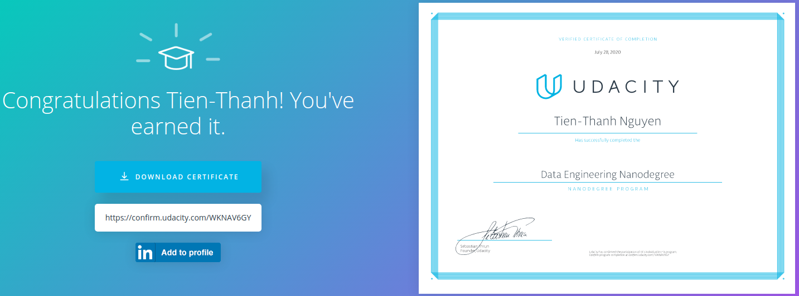

# DATA ENGINEER NANODEGREE PROGRAM

Model, build & automate production-ready Big Data infrastructure

## Module 1: Data Modeling with SQL & NoSQL

- How different database types meet different data use cases
- Create relational databases & ETL pipelines with PostgreSQL
- Create non-relational databases & ETL pipelines with Apache Cassandra

### Project 1: MODEL SPARKIFY’S SONG & USER DATA

Create custom database schemas & ETL pipelines with PostgreSQL, Apache Cassandra and Python

#### [Project 1.1: Data Modeling with Postgres](https://github.com/t-thanh/data-engineer-nd/tree/master/Project1.1_Data_Modeling_With_Postgres)

#### [Project 1.2: Data Moldeling with Apache Cassandra](https://github.com/t-thanh/data-engineer-nd/tree/master/Project1.2_Data_Modeling_with_Apache_Cassandra)

## Module 2: Building Data Warehouses in the Cloud

- Understand how to use essential computing, storage, and analytics tools in Amazon Web Services (AWS)
- Dissect the core components of data warehouses and learn how to optimize them for different situations
- Implement a data warehouse in AWS — including scalable storage, ETL strategies and design & query optimization

### [Project 2: PROCESS DATA IN THE CLOUD](https://github.com/t-thanh/data-engineer-nd/tree/master/Project2_Data_warehouse)

Build an ETL pipeline that extracts data from Amazon S3, stages it in Redshift and transforms it into tables

## Module 3: Building Data Lakes with Apache Spark

- Practice using Apache Spark for cleaning and aggregating data
- Run Spark on a distributed cluster in AWS and learn best practices for debugging & optimizing Spark apps
- Dive into data lakes — understand their importance, core components, and different setup options & issues in the cloud
- Build data lakes & ETL pipelines with Spark

### [Project 3: SCALE PIPELINES WITH DATA LAKES](https://github.com/t-thanh/data-engineer-nd/tree/master/Project3_Data_Lake)

Sparkify’s data keeps growing! Time to move from data warehouse to data lake with Spark

## Module 4: Optimizing Pipelines with Airflow

- Understand how Airflow works and configure, schedule and debug pipeline jobs
- Track data lineage, set up schedules, partition data for optimization, and write tests that ensure data quality
- Build production data pipelines with a strong emphasis on maintainability and reusability

### [Project 4: MONITOR & AUTOMATE WITH AIRFLOW](https://github.com/t-thanh/data-engineer-nd/tree/master/Project4_Data_Pipelines)

Automate Sparkify’s systems with dynamic, reusable pipelines that allow easy backfills

## Module 5: Independent Capstone Project

- Choose a use case that appeals to your analytics table, app back-end, source-of-truth database, etc.
- Gather the data you'll be using for your project (at least two sources and >1 million rows)
- Explore the data, clean it, model it, and then build, monitor and optimize the appropriate ETL for its consumption

### [Project 5: INDEPENDENT CAPSTONE PROJECT](https://github.com/t-thanh/data-engineer-nd/tree/master/Project5_Capstone)

Build your own end-to-end data-engineering project, then perfect your code with the help of our reviewers
